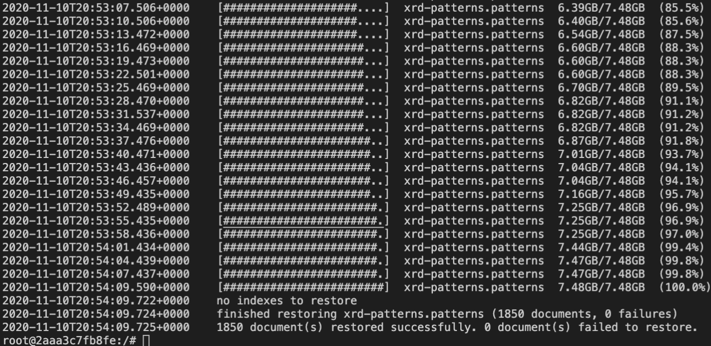
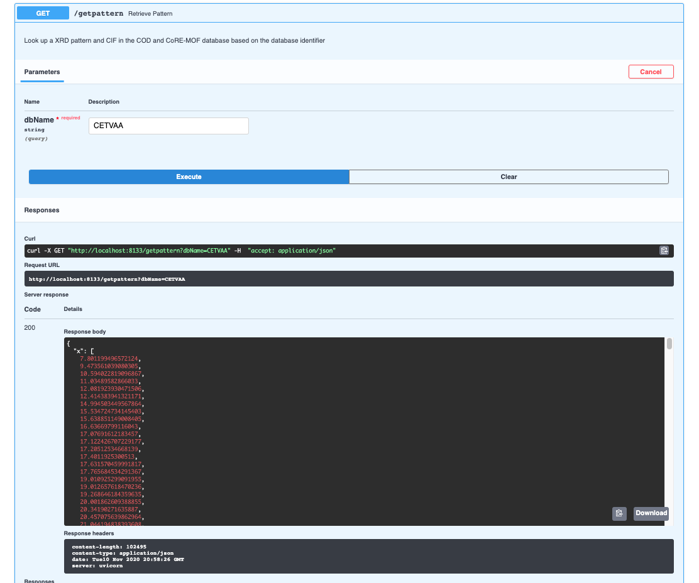

# CIF tools webservice


REST-API built with flask that exposes [pymatgen](https://duckduckgo.com/?q=pymatgen&t=brave) functionality.

## How to get it up and running

0. Make sure that you have the `bson` to seed the database in the `mongo-seed/dump/xrd-patterns` directory. You can download the file from [Dropbox](https://www.dropbox.com/s/ssu9o1o6a7xdr7o/patterns.bson?dl=0)
1. Start the docker-compose with `docker-compose up -d`
2. Then enter the `mongodb` container `docker exec -i -t xrd-predict_mongodb_1 bash`
3. Seed the database by running `mongorestore dump`

<a href="url"></a>

4. If you visit the documentation at `localhost:$PORT` you can test if the lookup works

<a href="url"></a>


## Implemented methods

- `GET` to `/` shows some basic info
- `GET` to `/version` shows the version
- `POST` to `/predictxrd` with `fileContent` data (CIF as string) returns:

  - `x`: with the 2 theta positions of the reflexes
  - `y`: intensity of the reflexes
  - `hkl` array of objects `{hkl: , multiplicity: }`

  if you also provide `jcamp=true` you will receive

  - `jcamp`: a string of the JCAMP-DX file with the predicted pattern

  you can also specify a `wavelength` which must be one of the following strings: CuKa, CuKa2, CuKa1, CuKb1, MoKa, MoKa2, MoKa1, MoKb1, CrKa, CrKa2, CrKa1, CrKb1, FeKa, FeKa2, FeKa1, FeKb1, CoKa, CoKa2, CoKa1, CoKb1, AgKa, AgKa2, AgKa1, AgKb1.
- `POST` to `/latticepattern` with a request body of the following form
```
{
  "a": 0,
  "b": 0,
  "c": 0,
  "alpha": 0,
  "beta": 0,
  "gamma": 0,
  "wavelength": "string",
  "jcamp": false
}
```
returns an answer as `/predictxrd`
- `GET` to `/getpattern?dbName=` returns and object of the following form
```
{
  "x": [
    null
  ],
  "y": [
    null
  ],
  "hkls": [
    null
  ],
  "dbName": "string",
  "link": "string",
  "cif": "string",
  "apiVersion": "string"
}
```
